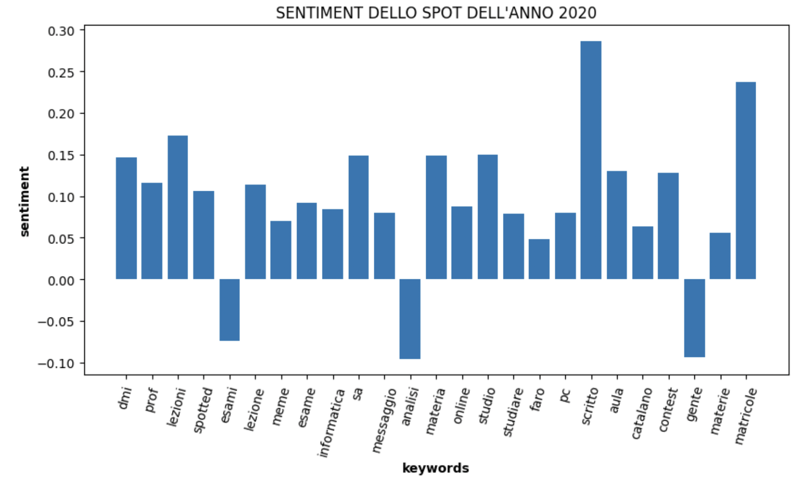
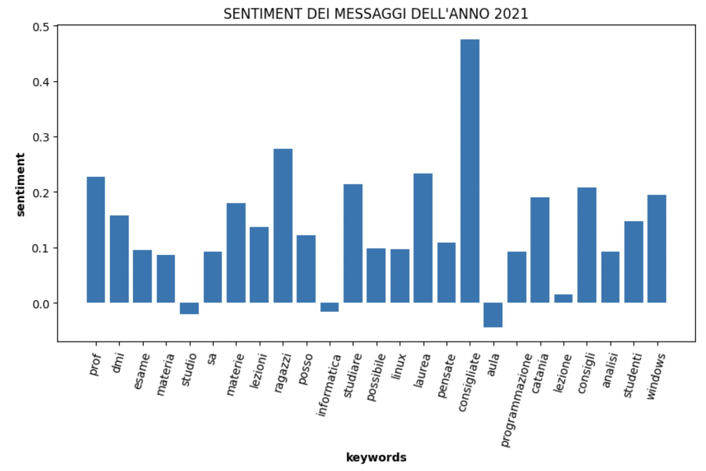

# Sentiment Analysis della community "Spotted DMI"

### 1. Introduzione
Progetto per la materia "Social Media Management", Prof. Antonino Furnari, A.A. 2022/2023. Il progetto proposto prevede la realizzazione di un'analisi del sentiment sugli spot della community "Spotted DMI", la quale raccoglie pensieri e opinioni di professori e studenti del corso di Matematica e Informatica su una varietà di argomenti. Per condurre l'analisi, verranno identificate le parole più significative (keywords) da un set di spot utilizzando la misura statistica Term Frequency-Inverse Document Frequency (tf-idf). Successivamente, verrà effettuata una sentiment analysis sugli spot contenenti queste parole chiave tramite l'algoritmo Vader. Infine, verrà stimato un "sentimento medio" per ogni parola chiave, al fine di comprendere l'opinione della community su ciascuna di esse.

### 2. Limitazioni
Le principali limitazioni del progetto riguardano la capacità dei modelli di Sentiment Analysis basati sulla lingua italiana. Per superare questo problema, gli spot sono stati tradotti in inglese e successivamente analizzati utilizzando un algoritmo basato su VADER. Sebbene le performance risultino migliori rispetto all'uso di un analyzer in lingua italiana, la traduzione di testi scritti in modo informale comporta una significativa perdita di contesto.

### 3. Immagini

